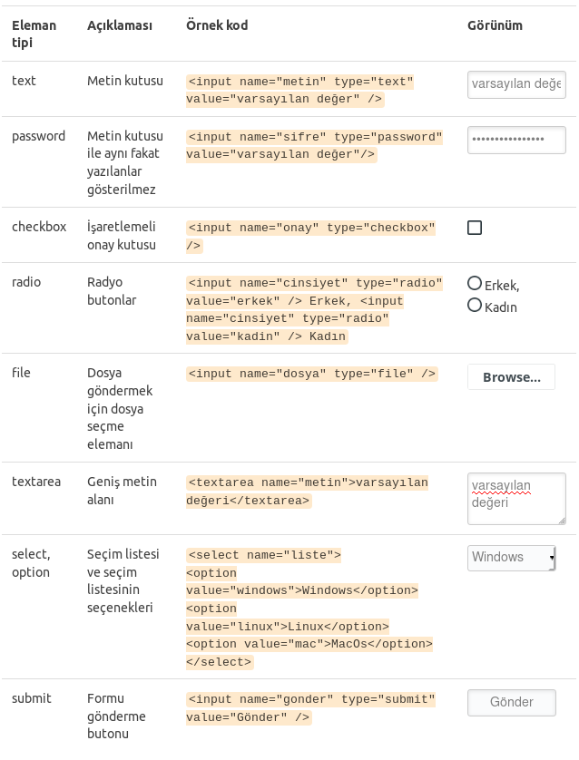

<h1>Sıfırdan Php ve MySQL Eğitim Notları</h1>
<div>Bu kod satırlarında hem php kodları hem ise php ile ilgili notlarım yer alacak.</div>
<div>Phpde değişkenler; </div>
  <div>$ işareti ile tanımlanırlar.</div>
  <div>Harf veya _ karakteri ile başlar.</div>
  <div>Sayı ile başlayamazlar.</div>
  <div>Türkçe karakterler içerebilir.</div>
  <div>Büyük-küçük harfe duyarlıdırlar. (case-sensitive)</div>
<div>Atama Operatörü (=)</div>
<h2>Case Sensitive Özelliği(Büyük-Küçük Harfe Duyarlı)</h2>

``` 
<?php 
$degisken="Degisken1";
$Degisken="Degisken2";
$_degisken="Degisken3"; 
echo $degisken; 
?>
Localhost:Degisken1
```
<h2>Php'de Veri Türleri</h2>
<div>Veri Türleri (Data Types)</div>
  <div>String "yazı" 'yazı"</div>
  <div>Integer 500, 200</div>
  <div>Float (Double) 5.5, 7.2</div>
  <div>Boolean (true, false)</div>
  <div>Array (Dizi)</div>
  <div>Objecy (Nesne)</div>
  <div>NULL (Hiçbir şey)</div>
 <div>gettype()Gettype fonksiyonu bize değişkenin hangi veri tipinde olduğunu gösterir.</div>   
  
```
<?php 
$string="yigithan yilmaz";
$int= 500;
$float= 5.5;
$bool= false;
$array= array();
$object= new stdClass;
$null= NULL;
echo gettype($null);
?>
Localhost:NULL
```

<h2>Php'de Sabit Değişkenler</h2>
<div>Sabit Değişkenler;</div>
  <div>define() fonksiyonu ile tanımlanır.</div>
  <div>Türkçe karakterler içerebilir.</div>
  <div>Sayı ile başlayamaz.</div>
  <div>Harf yada _ işareti ile başlar.</div>
  <div>Büyük-küçük harfe duyarlıdır.(case-sensitive)</div>
<div>Veri türlerinde;</div>
  <div>Object hariç tüm veri türlerini kapsar.</div>
  
  ```
  <?php 
$yigithan= "yigithan yilmaz1";
//echo $yigithan;
define("yigithan", "yigithan yilmaz2");
echo yigithan;
?> Localhost:yigithan yilmaz2
```

<h2>Php'de Sihirli Karakterler</h2>
<div>Sihirli Karakterler;</div>
<div> \t = Tab karakteri yerine geçer.</div>
<div> \n = Yeni satır karakteri (new line).</div>
<div> \\ = karakter bir başka sihirli karaktere denk geldiğinde örneğim “\temel\” gibi bir ifade kullanmak istedik. Bu durumda \t tab karakteri olarak algılanacağından tanımlamamış şu şekilde olmalı “\\temel\”.</div>
<div> \$ = çift tırnak içerisindeki ifadelerde değişkeleri kullanabiliyoruz. Fakat biz değişkenin değerini almak değilde kendisini görmek istersek “bu bir \$degisken” şeklinde kullanmalıyız.</div>
<div> \’ = tek tırnak ile tanımladığımız bir ifade içinde tek tırnaklı bir sözcük kullanmamız gerekirse önüne \ işareti eklemek gerekir. Örneğin $degisken = ‘Uğur dedi ki \’merhaba php\’ dedi’ </div>
<div> \” = çift tırnak içinde bir ifade yazarken çift tırnak kullanmamız gerekirse önünde \ eklememiz gerekir.</div>

```
<?php
$test= "yigithan\t\t\t\nyilmaz \\test\ ";
$ad= "Yigithan";
//echo "\$ad değişkeni $ad değerine eşittir.";
echo "Yigithan dedi ki: \"Piyasa benden sorulur\"..";
?> Localhost:Yiğithan dedi ki: "Piyasa benden sorulur"..
```

<h1>Php'de Operatörler</h1>
<h2>Aritmetik Operatörler</h2>
  <div>Toplama +</div>
  <div>Çıkarma -</div>
  <div>Çarpma *</div>
  <div>Bölme /</div>
  <div>Mod (Kalan) %</div>
  
  ```
  <?php
  $a=15;
  $b=4;
  //echo $a + $b;
  //echo $a - $b;
  //echo $a * $b;
  //echo $a / $b;
  //echo $a % $b;
  ?>
  ```
  
  <h2>Atama Operatörleri</h2>
    <div>Değer Atama =</div>
    <div>Arttırarak Değer Atama +=</div>
    <div>Azaltarak Değer Atama -=</div>
    <div>Bölerek Değer Atama /=<div>
    <div>Çarparak Değer Atama *=</div>
    <div>Modunu Alarak Değer Atama %=</div>
    <div>Birleştirme Operatörü .</div>
    <div>Birleştirerek Değer Atama .=</div>
  
  ``` 
 <?php
// $a  +=5; // $a = $a + 5;
// $a  -=5; // $a = $a - 5;
// $a  /=5; // $a = $a / 5; 
// $a  *=5; // $a = $a * 5; 
// $a  %=5; // $a = $a % 5;

$ad= "Yigithan";
$soyad="Yilmaz";

// echo "Yigithan" . "Yilmaz" . 24 . $ad . "yigithan" . $soyad; Localhost= YiğithanYilmaz24YigithanyigithanYilmaz

$ad .="" . $soyad; // $ad = $ad . $soyad; --->Birleştirerek Atama
echo $ad; Localhost=Yigithan Yilmaz
```

<h2>Arttırma ve Azaltma Operatörleri</h2>
  <div>$a++</div>
  <div>++$a</div>
  <div>$a--</div>
  <div>--$a</div>
  
  ```
<?php
$a = 5; 
echo **$a;
echp $a; Localhost=44
?>
 ```
 
<h2>Karşılaştırma Operatörleri</h2>
  <div>Eşittir ==</div>
  <div>Eşit Değildir !=</div>
  <div>Büyüktür > </div>
  <div>Küçüktür < </div>
  <div>Büyükse yada Eşitse >= </div>
  <div>Küçükse yada Eşitse <= </div>
  <div>Denkse === <div>
  <div>Denk Değilse !== </div>

```
<?php
$a = 5;
$b = 6;
Localhostumuza gelen değer true(1) yada false(hiçbir şey) olacaktır.Verilen sayı ve operatöre göre değişir.
echo $a !== $b;
?>
```

<h2>Mantıksal Operatörler</h2>
  <div>&& - AND - Ve</div>
  <div>|| - OR - Ya da</div> 
  <div>! - Değilse</div>
  
```
<?php
$a = 5;
$b = 5;

//echo ($a == $b) && ($a + $b == 9); Burada ilk değerimiz doğru ama ikinci değer yanlış çıktığı için localhost false .
//echo ($a != $b) || ($a + $b == 14) || ($â -$b == 0); Burada yada kullandık biri hatalı ama diğeri doğru lhost true .

echo !($a != $b); Burda eşit değilse dedik üstüne bi de değilse gelirse yeniden eşittir oldu.Lhost:True.
?>
```

<h1>Php'de Koşullu İfadeler</h1>
<h2>If-Else İfadesi</h2>
 
 ```
 <?php
if ($a > $b) {
    echo "a büyüktür b";
} elseif ($a == $b) {
    echo "a eşittir b";
} else {
    echo "a küçüktür b";
}
?>
<?php
2.Örnek
if ($a == 4) {
    echo "a değişkeninin değeri 4'tür";
} elseif ($a == 6) {
    echo "a değişkeninin değeri 6'dır";
} else {
    echo "Hiçbir koşul yerine getirilmedi.";
}
?>
```

<h2>Switch-Case İfadesi</h2>

```
<?php
$a =5;
Switch ($a){
  case 5:
    echo 'a 5'e eşit';
  break;
  case 6:
    echo 'a 6'ya eşit';
  break;
  case $a % 4 ==3:
    echo '7'yi 4'e bölünce kalan 3'tür';
  break;
  default:
    echo'Hiçbir şeye eşit değil';
  break;  
?>
```

<h2>Ternary (Üçlü Operatör Kullanımı)</h2>
  <div>Kısaca anlatayım.İf'i tek satır içinde nası kullanırız.İşte yardımımıza ternany yetişiyor.</div>
  
  ```
<?php
// Uzun Hali //
$a = 5;
if ($a == 5){
  echo "a 5'e eşit";
} else { 
  echo "a 5'e eşit değil";
}
// Ternany Sayesinde Kısa Kullanılmış Hali // 
echo $a == 5 ? "a 5'e eşit" : "a 5'e eşit değil";
?>
```

<h2>If-Else ve Switch-Case İçin Alternatif Sözdizimleri</h2>

```
Switch-Case İçin Olanı
$a = 5;
switch ($a):
  case 5:
    echo '1';
break;
case 6:
  echo '2';
break;
default:
  echo '3';
break;
endwitch;

If-Else İçin Olanı
if ($a == 5);
  echo '1';
elseif ($a == 6):
else:
  echo '3';
endif;
Farkı anlamışsınızdır umarım.
```

<h1>Php'de Diziler</h2>
<h2>Php'de Dizi Oluşturmak</h2>

```
<?php
$ad= "Yigithan";
$soyad = "Yilmaz";
$meslek = "Geliştirici";
$yas = 16;
// Dizi Tanımlama
  1- array()
  2- []
$kimlik = array (
 'ad' => "Yigithan",
 'soyad' => "Yilmaz",
  'meslek' => "Geliştirici",
  'yas' => 24
Eğer üsttekilere ad atamazsak direkt php 0,1,2,3 değerlerini atar.
);  
//echo $kimlik; Der isek olmaz çünkü ifademiz bir array.
//Dizi İçindeki Elemanlara Erişmek
  //echo $kimlik['meslek']
    -print_r($kimlik);
Dizi Tanımlamanın 2.Yolu
$kimlik2 = [
  'ad' => "yigithan",
  'soyad' => "yilmaz",
  'meslek' => "geliştirici",
];
?>
Php'de iki farklı dizi oluşturmayı gösterdim.Hadi gelin bir sonraki derse geçelim.
```

<h2>Php'de İç İçe Dizi Oluşturmak</h2>

```
  //Siteler
      E-Ticaret
        Sahibinden
        N11
        HepsiBurada
      Eğitim
        Udemy
<?php
$kategoriler = [
  'siteler' => 'siteler'
      'e-ticaret' => [
        'sahibinden',
        'n11',
        'hepsiburada',
      ],
      'egitim' => [
        'udemy',
        'prototurk',
      ]  
];
echo $kategoriler['siteler'][e-ticaret][2]; Lhost:hepsiburada
print_r($kategoriler);
?>
```

<h2>Php'de Sabit Değişkenlerde Dizilerin Kullanımı</h2>

```
<?php
define('UYE',[
  'ad' => 'Yigithan',
  'soyad' => 'Yilmaz',
  'meslek' => 'Geliştirici',
  'yas' => 24,
  'sporlar' => [
    'jet kune do',
    'bisiklet sürmek'

]);
//define('UYE',array());
echo UYE['sporlar'][1]; Lhost:Bisiklet sürmek.
Bunlarda anlaşılmayacak bir şey yok zaten.Diğer derse geçelim.
?>
```

<h1>Php'de Döngüler</h1>
<h2>For Döngüsü</h2>

```
<?php
for ($i = 1; $i <= 10; $i++){
  echo $i . '<br>';
}
for($i = 10; $i > 0; $i--={
  echo $i . 'br';
}

$arr = [
  'udemy',
  'prototurk',
  '93academy',
  'yigithan.com',
];

for ($i = 0; $i <= (count($arr)); $i++){
  echo $arr[$i] . 'br';
    
for ($i = 0; $i <= (count($arr)); $i--){
echo $arr[$i] . 'br';

for ($i = 1; $i <=10; $i++){
  echo $i . 'br';
  
for ($i = 1; $i <=10; $i++):
  if ($i == 3) continue;
  echo $i . 'br';
  if ($i == 6) break;
endfor; Lhost:12456  
?>
```

<h2>Foreach Döngüsü</h2>

```
<?php
///Foreach (ARRAY as KEY => VALUE){
}

$sayilar = [1,2,3,4,5,6,7,8,9,10];

foreach($sayilar as $sayi){
  echo $sayi . 'br';
} lhost 1den 9a kadardır

 $uyeDetay = [
  'ad' => 'Yigithan',
  'soyad' => 'Yilmaz',
  'yas' => 24
];

foreach($uyeDetay as $key => $val){
  echo $key . ':' . $val . 'br';
} key dediklerimiz ad soyad yas val karşısındakiler
  ?>
  ```
  
  <h2>While Döngüsü</h2>

```
  <?php
    while(KOŞUL TRUE){} 
$i = 1;    
  
  while ($i >0){
    echo $i . 'br';
    $i--; Bu komutu koymasaydık while döngümüz sonsuza kadar devam edecekti.
  endwhile; 
?>
```

<h2>Do-While Döngüsü</h2>
<div>Do-While döngüsünün whiledan farkı ilk do'da 1 defa çalışır.Sonra döngü içindeki koşul sağlanırsa tekrar çalışır.</div>

```
<?php
$a = 6;
do{
  echo $a . 'br';
  $a++;
} while($a <= 5);
?>
```

<h1>Php'de Fonksiyon Kullanımı</h2>
<div>Neden Fonksiyon Kullanıyoruz ?</div>
<div>Çünkü fonksiyonları kullandığımızda ve bir değişiklik yaptığımızda değiştirmesi ve uygulaması daha kolay olur.</div>
<div>Fonksiyonlar için function kodumuzu kullanıyoruz</div>

```
<?php

  function test()
  {
    return "test"; Return değerimi geriye döndürür.
  } 
  
  $a = test(); Bunu a değişkenine eşitlersem bu a değişkeninin değeri fonksiyondan dönen değere eşitlenecek.
  //echo $a;
  Fonksiyonlar parametre alabilirler.
  function topla($sayi1, $sayi2)
  {
    return ($sayi1=2 + $sayi2=10);
    
  $toplam = topla(5); 
  İkinci parametreyi vermek zorundayız.Ama üstteki gibi değer atarsak gerek kalmaz.1.sayımız 2 değil 5 olur çünkü altta 5 verdik.
  echo $toplam; lhost:17 
  
  global
  $GLOBALS
  $ad = 'Yigithan';
  
  function adsoyad($soyad)
  {
    global $ad; Artık kullanabiliriz.Lhost: Yigithan Yilmaz 2.yolu returnün içinde aşşağıda.
    return $GLOBALS['ad']   . ' '. $soyad;
    return $ad .  . ' '. $soyad;
    Böyle bir şekilde kullanamayız.Çünkü bunu global  olarak değişkenin içidne kullanmamız gerekiyor.
  }
  echo adsoyad('Yilmaz'); 
  
  $yazi = "yigithan yilmaz yigithan yilmaz";
  //echo substr($yazi, 0, 10). '...'; Bu yazıda 10.harfe basamağa kadar gelip 3 nokta eklemek demek.
  
  function kisalt($str, $limit=10)
  {
    $karakterSayisi = strlen($str);
    if ($karakterSayisi > $limit){ Burda karakter sayısını aldık.
      $str = substr($str, 0, $limit) . '..'; 
      Sonra karakter sayısı 5'den yani limit değerinden büyük ise demek oluyor ki benim yazım uzun kısaltmam lazım
    }
    return $str;
    echo kisalt($yazi, 5); Lhost :yigit.. Eğer yazımız beş karakterli olsaydı sadece yigit yazacaktı.
?>
```

<h2>Php'de Anonim Fonksiyonlar</h2>
<div>Normal fonksiyonlarda function test(){} deriz anonim fonksiyon ise function(){} diye yazılır.Farkı altta göreceksiniz</div>

```
<?php

function test()
{
  return 'test';
}
echo test();
↓ Anonim Fonksiyon Örneği ↓
$test = function($par) --> Burda bir değişkeni fonksiyon gibi kullanabiliyoruz.
{
  return 'test' . $par;
};
//echo $test ('yigithan');

$arr = [ 
  function(){
    return '1. fonksiyon';
  },  
  function(){
    return '2. fonksiyon';
  },  
  function(){
    return '3. fonksiyon';
  }
];
echo $arr[rand(0.2)]();

function filtrele($isim)
{
  return $isim . 'Erbilen';
}  
$arr = ['Tayfun','Jhonny','Micheal','Keirann'];

$arr = array_map(function($isim)
{
  return $isim . 'Erbilen';
}, $arr);
print_r($arr);
------------
Anonim fonksiyon içinde global kullanmamıza gerek yok.Onun yerine use kullanıyoruz.Hemen alta örneğini yapalım.
$soyad = 'Yilmaz';

$arr = ['Tayfun','Jhonny','Micheal','Keirann'];

$arr = array_map(function($isim) use($soyad){
  return $isim . ' ' . $soyad;
}i $arr);
print_r($arr);
-----------
$test = function($par) 
{
  return 'test' . $par;
}

$test2 = function() use ($test){ --->Test fonksiyonunu diğer fonksiyonumuzun içerisinde kullanıyoruz.
  return 'test2' . $test('test3');
};
echo $test2();
?>
```
<h2>Fonksiyonda Sınırsız Parametre Göndermek</h2>
<div>Bir fonksiyonda kaç tane parametre geleceğini bilmiyor olabiliriz.</div>
<div>Bu fonksiyonla kaç tane argüman , kaç tane parametre gelmiş onu buluyoruz.--> func_num_args()</div>
<div>Bu fonksiyonla parametrelerin listesini dize olarak indirebiliyoruz. --> func_get_args()</div>
<div>Bu fonksiyona da bir index numarası vererek o fonksiyonun,parametrenin değerine ulaşırız.--> func_get_arg()</div>

```
<?php
function test()
{
  echo func_num_args(); Lhost : 4 Parametre sayısını verdi.
  print_r(func_get_args()); 0 - Yigithan 1- Yilmaz 2 - Sivas 3- Cuguli tane parametre şeklinde gösterdi.
  ------
  echo func_get_arg(2); Lhost : Sivas çıkar.
}
test ('Yigithan', 'Yilmaz' ,'Sivas' ,'Cuguli');
?>
```

<h2>Recursive Fonksiyonlar(Kendi Kendini Çağıran Fonksiyonlar</h2>

```
<?php

  function say($sayi)
  {
    echo $sayi;
    if ($sayi <10){ 
      say($sayi +1);
    }  
}
say(1);
-----
id dediğimiz şey mesela derslerin idsi 1 biz 1'i parent olarak kullandığımız yer onun alt başlığı olacak.Mantık.
parent ise üst nesne demek yani en baştaki ana kategori demek.

$kategoriler = [
  [
    'id' => 1;
    'parent' => 0,
    'ad'=> 'Dersler'
  ],
  [
    'id' => 2,
    'parent' => 0,
    'ad' => 'Güncel'
  ]
  [
    'id' => 3;
    'parent' => 0,
    'ad'=> 'Blog'
  ], 
  [
    'id' => 4;
    'parent' => 1,
    'ad'=> 'PHP Dersleri'
  ],
  [
    'id' => 5;
    'parent' => 4,
    'ad'=> 'PHP Nedir?'
  ],
  [
    'id' => 6;
    'parent' => 1,
    'ad'=> 'CSS Dersleri'
  ],
];

function kategoriListele($kategorileri $parent = 0)
{
  echo '<ul>';
  foreach($kategoriler as $kategori){
    if ($kategori['parent'] == $parent){ Burda dedik ki parentı sıfır olanları lhostta görelim .
      echo '<li>' . $kategori['ad']';
      echo kategoriListele($kategoriler, $kategori['id']);
      echo '<li>';
    } 
  }
}
kategoriListele($kategoriler);

Eğer html değeri şeklinde olacak olsaydı başa bunlar gelecekti.
$html = '';
Echoların tamamına $html .= değerini verecektik.
Sona return $html diyecektik ve hemen alttaki kategorilistelenin önüne echo koyacaktık.Bu kadar.
-------
$arr = [
  'ad' => 'yigithan',
  'soyad' => 'yilmaz',
  'sporlar' => [
    'yuzme' => 'evet',
    'kosma' => 'evet',
    'savunma_sporlari' => [
      'karate' => 'evet',
      'kick-boks' => 'hayır'
    ]            
  ]  
];
  function dizide_bul($dizi, $anahtar)
  {
    foreach ($dizi as $key => $val)
    {
      if ($key == $anahtar){
        return $val;
      } 
      if (is_array($val)){ --> sporlar değeri array olduğu için array olarak tanıttık.
      $sonuc = dizide_bul($val, $anahtar);
      if ($sonuc){
        return $sonuc;
    }
    return false;
  }
echo dizide_bul($arr, 'kosma'); Lhost: evet
Mesela savunma sporlarını üstteki kosmaya yazarsek olmaz print r ile yazmalıyız çünkü o bir dizi.
Buraya sporun altındaki kosma değerini direkt bir şekilde alamayız o yüzden hemen 3 satır üstteki kod bize yardımcı olacak.
?>
```

<h2>Fonksiyon Varlık Kontrolü (-function_exists()-)</h2>
<div>Bunu neden kullanıyoruz ?</div>
<div>Bu fonksiyon var mı ? Yok mu ?</div>
<div>Çünkü her fonksiyon,internette araştırıp bulabileceğiniz her fonksiyonu kullanamayabilirsiniz.</div>
<div>Çünkü bazı paketler PHP'ye sonradan yüklenir.</div>

```
<?php

function test(){
  return 'test';
}

if (function_exists('test')){
  echo 'test fonksiyonu vardır';
} else {
  echo 'test fonksiyonu yoktur';
}
mb_substr --> İleriki konularda anlatılacaktır.Şimdilik üsttekileri bilseniz yeter.
?>
```

<h2>PHP'de Üreteç Fonksiyonlar (Yield)</h2>
<div>Range fonksiyonunda iki değer verirsiniz.Başlangıç ve limit değeri.Örnek --> range(0, 10000)</div>
<div>Yani kısaca yield returne çok benziyor ama farkı değeri döndürürken işlemi sonlandırmıyor, işleme devam ediyor.</div>

```
<?php
  function say($baslangic, $limit)
  {
    $arr = []; #
    for ($i = $baslangic; $i <= $limit; $i++)
    {
      $arr[] = $i; #
    }
    return $arr; #
  }
  yield kullanırken array kullanmamıza gerek yok direkt for kodumuzun altına yield $i; der isek işlemimiz yine işler.
  $sayilar = say(0, 10000);
  print_r($sayilar); der isek --> Generator object oldu.print_r yerine yazılacak kod hemen altta.
  ↓↓↓↓↓↓↓↓↓↓↓↓↓↓↓↓↓↓↓↓↓↓↓↓↓↓↓↓↓
  foreach ( $sayilar as $sayi ){
    echo $sayi. 'br';
}
memory_get_usage() ---> Ne kadar bellek yemiştir onu gösterir.Byteı mb çevirmek için altta fonksiyon kullanacağız.1mb=1048576byte
function byteTomB($byte)
{
  return number_format($byte / 1048576, 2); -->Number format mesela (değer uzun) diyeceğin 32.33 mb diyerek kısaltmamızı sağladı.
}
$sayilar = range (0, 1000000);

echo byteToMB (memory_get_usage()) . ' MB bellek kullanıldı';
?>
```
<h2>Fonksiyonda Static Değişken Kullanımı</h2>
<div></div>

```
<?php

function say(){
  static $sayi =1;
  echo $sayi . '<br>';
  $sayi++;
}

say();
say();
say();
say();
say();
say();
Staticli lhost : 1,2,3,4,5,6 Staticsiz lhost:1,1,1,1,1,1

function yukle($deger){
  static $yuklenenler = [];
  $yuklenenler[] = $deger;
  return $yuklenenler;
}

yukle('test.php');
yukle('a.php');
$yuklenenler = yukle('b.php');

print_r($yuklenenler);  Staticsiz yapsaydık sadece b.php gözükecekti.Static kullandığımızda ise hepsini yazdırdı.
?>
```

<h2>PHP7 Parametre ve Return Değişken Türü Dayatması</h2>
<div>Biliyorsunuz ki fonksiyonlarda parametre gönderiyoruz.Bu parametlerin veri tiplerini belirleyebiliyoruz.</div>
<div>Mesela sadece integer gelsin,sadece string gelsin diye ve return ederken sadece array etsin diyebiliyoruz.</div>

```
<?php

declare(strict_types = 1); Sadece integerı kabul edecek .

function topla(int $sayi1,int $sayi2) : string | Der isek bu sefer de değişkenleri string kabul edecek. 
{
  return $sayi1 + $sayi2;
}
echo topla("1",3); 
1 değerimiz string olduğu için fatal error aldık.
------------
function arr(array $arr): string
{
  return $arr;
}
print_r(arr(["test","test2"])); Bunda da fatal error alıyoruz çünkü array ifadesini kullandık ama bizden string istedi.
?>
```
<h1>PHP'de Dizi Fonksiyonları</h1>

<h2>PHP'de Dizi Fonksiyonları-1</h2>

<div>Kullanacağımız fonksiyonları en baştan alt alta yazalım.</div>

```
print_r()→Bir dizinin yada bir objenin okunabilir (insancıl)şekilde yapısın gösterir.

var_dump()→print_r'ın daha detaylı şeklidir.

explode()→Belli bir karakterle bir ifadeyi parçalayıp bir dize haline getirir.

implode()→Bir diziyi istediğimiz bir karakterle birleştirip string ifadeye çevirmemizi sağlar.Explodeun tam tersi.

count()→Count ise bir dizinin kaç tane elemanı bulunduğunu bulmamızı sağlıyor.

is_array()→Bir kontrol fonksiyonudur.İçerisine giren değişkenin dizi mi değil mi olduğunu kontrol etmemizi sağlar.

shuffle()→Diziyi karıştırarak tekrardan her bastığımızda farklı şekilde bastırmasını sağlıyor.

array_combine()→İki farklı diziyi anahtar değer olarak birleştirmek için kullanılır.

array_count_values()→Bir dizide tekrarlanan elemanların kaç kez tekrarlandığını bulmak için kullanılır.

array_flip()→Anahtarlar ile değerlerin yerlerini değiştiriyor.Yani anahtar değer,değer anahtar oluyor.

array_key_exists()→Dizi içinde belirlediğimiz anahtarın olup olmadığını konrol etmek için kullanılır.
------------------
Var dump print r
------------------
<?php

$arr = [
  'ad' => 'yigithan',
  'soyad' => 'yilmaz',
  'yas' => 24
];
//print_r($arr);
var_dump($arr=;
------------------
explode()parçalar
------------------
$test = 'Yigithan,yilmaz,sivas';
$arr = explode(',', $test);

print_r($arr); Lhost : 0-Yigithan 1 -yilmaz 2- sivas
--------------------
implode()birleştirir
--------------------
$test = 'Yigithan,yilmaz,sivas';
$arr = explode(',', $test);
$string = implode('|', $arr);
echo $string; Lhost: Yigithan|yilmaz|sivas
------------------
count()kaç eleman
------------------
echo count($arr); Lhost :3 üstteki koda göre devam ediyoruz.
------------------
is_array()if else
------------------
if(is_array($arr)){
    echo 'Bu bir dizidir';
} else {
    echo 'Bu bir dizi değildir!';
}    Lhost : Bu bir dizidir.
------------------
shuffle()karıştır
------------------
$arr = [1,2,3,4,5,6,7,8,9,10];
shuffle($arr);
print_r($arr); Lhost: Her bastığımızda random değer geliyor.
--------------------------------------------
array_combine() 2 farklı anahtar birleştirme
--------------------------------------------
$keys = ['ad', 'soyad];
$values = ['yigithan', 'yilmaz'];
$arr = array_combine($keys, $values);
print_r($arr); Lhost ad => yigithan soyad => yilmaz
--------------------------------
array_count_values()  kaç tekrar
--------------------------------
$arr = ['yigithan','yilmaz','udemy','yigithan','udemy'];
$arr2 = array_count_values($arr);
print_r($arr2); Lhost : yigithan  => 2 yilmaz  => 1 udemy  => 2
-------------------------
array_flip() yer değiştir
-------------------------
$arr = [
  'ad' => 'yigithan',
  'soyad' => 'yilmaz',
  'yas' => 16
];
$arr2 = array_flip($arr);
print_r($arr2); Lhost : yigithan => ad yilmaz => soyad 16 => yas
---------------------------------------------------------
array_key_exists() anahtarın olup olmadığını kontrol etme
---------------------------------------------------------
$arr = [
  'ad' => 'Yigithan' 
    'soyad => [
      'b' => [
        'c'=> [
          'd' => 'e'
        ]
      ]
    ]
    
];
if (array_key_exists('ad', $arr)){
  echo 'ad anahtarı var!';
} else {
  echo 'ad anahtarı yok.';
} İç çe fonksiyonlarda bu fonksiyon işimize yaramaz çünkü hep aynı döndürür.O yüzden kendi fonksiyonumuzu oluşturacağız.
--------------
function _array_key_exists($cur_key, $arr){
  foreach($arr as $key => $val){
    if ($key == $cur_key){
      return true;
    } 
    else{
      return true;
      }
    if (is_array($val)){
      return _array_key_exists($cur_key, $val);
    }
  }   
  return false;
}
    
if (array_key_exists('c', $arr)){
  echo 'c anahtarı var!';
} else {
  echo 'c anahtarı yok.';
?>
```

<h2>PHP'de Dizi Fonksiyonları-2</h2>

<div>Kullanacağımız fonksiyonları en baştan alt alta yazalım.</div>

```
array_map()→Dizi içersindeki her elemanın değerini alır ve üzerinde bir oynama yaparak geriye döndürür.

array_filter()→Dizi içerisindeki değerleri boş elemanları kaldırmamızı sağlar.

array_merge()→İki diziyi birleştirmek için kullanılır.

array_rand()→İçinden rastgele (random) değerler seçmemizi sağlar.

array_reverse()→Bir fonksiyonu tersten yazmamızı sağlar.

array_search()→Dizide değer aramak için kullanıyoruz.Eğer değeri var ise anahtarını döndürüyor.

in_array()→Neredeyse array_search ile aynı değerin olup olmadığını arıyoruz.

array_shift()→Dizinin ilk elemanını seçip diziden çıkartır.

array_pop()→Dizinin son elemanını çıkartıp işlem yapar.Üsttekinin tam tersidir yani.

array_slice()→Dizinin belli bir aralığını seçmek için kullanılır.

array_sum()→Dizinin değerlerinin toplamını bulmak için kullanılır.

array_product()→Bu ise çarpımını bulmak için kullanılıyor.

array_unique()→unique adı üstünde benzersiz olması lazım.Dizide tekrarlanan elemanları siliyor.elemanların benzersiz olması lazım
-------------------------
array_map() manipülasyon(oynama yaparak geri döndürme)
-------------------------
<?php

function filtrele($val){
  return $val. '-';
$arr = [1,2,3,4,5];
$arr2 = array_map('filtrele', $arr);
//print_r($arr2);

$arr = ['','tayfun2','','erbilen']; Üstteki lhost 1 =>   2 =>tayfun 3 =>   4 => erbilen
print_r($ârr);
$arr = array_filter($arr); lhost sadece 2 ve 4 karşılarındarında değerleri olacak şekilde gözükecekler.
print_r($arr);
------------------
array_filter()
------------------
$arr = [1,2,3,4,5];
$arr2 = array_filter($arr, function($item){
  return $item > 2 && $item <5;
});
print_r($arr2);
----------------------------
array_merge dizi birleştirme
----------------------------

$arr1 = [1,2,3];
$arr2 = [4,5,6];

$arr = array_merge($arr1; $arr2);
print_r($arr); Lhost : 1,2,3,4,5,6
-------------------
array_rand rastgele
-------------------
$arr = [
  'ad' => 'tayfun',
  'soyad' => 'erbilen'i
  'yas' => 24,
  'site' => 'erbilen.net'
];
$random = array_rand($arr, 2); 
$values = array_ömap(function($key) use($arr){
  return $arr[$key];
}, $random);

print_r($values);
-----------------------------
array_reverse()→Tersten yazma
-----------------------------

$arr = [1,2,3,4,5];
print_r($arr); lhost : 1,2,3,4,5
$arr = array_reverse($arr);
print_r($arr); lhost : 5,4,3,2,1
-----------------------------------------
array_search()-> Değer ara anahtar döndür
-----------------------------------------

$arr = [
 'ad' => 'yigithan',
 'soyad' => 'yilmaz'
];
$test = array_search('erbilen', $arr);
echo $test; lhost : soyad ->Gerçekte amaç  anahtarı bulmak değil böyle bir değer var mı diye kontrol etmek. 
---------------------
$arr = [
 'ad' => 'yigithan',
 'soyad' => 'yilmaz'
 'a' => [
  'b' => [
    'c' => 'd'
    ]  
  ]
];
$test = array_search('d', $arr);

function _array_search($cur_val, $arr);
{
  foreach ($arr as $key => $val){
    if ($val == $cur_val){
      return true;
    }  
    if (is_array($val)){
      return _array_search($cur_val, $val);
    }  
  }
  return false;
}

$test =_array_search('d', $arr);
echo $test;
--------------------------------
in_array() değerin olup olmadığı
--------------------------------
$arr = [1,2,3,4];

if (in_array('6', $arr))
{
  echo '3 değeri var2;
} else {
  echo 'yok';
}  
------------------------
array_shift() ilk eleman
------------------------
$arr = [1,2,3,4,5];
 $ilk_eleman = array_shift($arr);
 print_r($arr); 1 hariç hepsini lhosta yazdırdı.
 -----------------------
 array_pop()→ son eleman
------------------------
$arr = [1,2,3,4,5];
$son_eleman = array_pop($arr);
print_r($arr); lhost 5 hariç hepsi
echo $son_eleman; lhost 5
-------------------------------------
array_slice()→ belli bir aralık seçme
-------------------------------------
$arr = [1,2,3,4,5]; 
İlk 2 eleman hariç hepsini alıcaz
$arr2 = array_slice($arr, 2);
print_r($arr');
--------------
$arr3= array_slice($arr, 2, 2); Sadece -2 yazsaydık son iki elemanı alırdık .
print_r($arr3); lhost : 2den başlayıp 2 arttırınca gelen sayılar : 3 ve 4 yani bu ikisidir.
---------------------------------
array_sum()→Dizinin değer toplamı 
---------------------------------
$arr = [1,2,3,4,5];
$toplam = array_sum($arr);
echo $toplam; lhost 15
----------------------
array_product() çarpım
----------------------
$arr = [1,2,3,4,5];
$carpim = array_product($arr);
echo $carpim; lhost : 120
-------------------------------
array_unique() benzersiz eleman
-------------------------------
$ârr  = ['tayfun','erbilen','tayfun','erbilen','udemy'];
print_r($arr); tayfun erbilen tayfun erbilen udemy
$arr2 = array_unique($arr);
print_r($arr2); lhost tayfun erbilen udemy
?>
```
<h2>PHP'de Dizi Fonksiyonları -3</h2>

<div>Kullanacağımız fonksiyonları en baştan alt alta yazalım.</div>

```
array_values()→Bir dizideki değerleri diğer diziye aktarır.

array_push()→Dizinin sonuna yeni bir eleman eklemek için kullanılır.

array_unshift()→Dizinin başına yeni bir eleman eklemek için kullanılır.

array_keys()→Dizinin anahtarlarını istemek için kullanılır.

current()→Dizinin ilk elemanını bulmak için kullanılır.

end()→Dizinin son elemanını bulmak için kullanılır.

next()→Dizideki sonraki elemanı bulmak için kullanılır.

prev()→Dizideki önceki elemanı bulmak için kullanılır.

reset()→Diziyi sıfırlayıp başa döndürür.

extract()→Anahtarları bir değişken gibi kullanmamızı sağlıyor.

asort()→Dizideki değerlere göre sıralanırlar.Küçükten Büyüğe
Dizi değeri dediğim mesela 6,3,8 diye 3 harf var bunlar 0,1,2 diye sıralanırlar anahtarda onların  sırası.
arsort()→Dizideki değerlere göre sıralanırlar.Büyükten Küçüğe

ksort()→Dizideki anahtarlara göre küçükten büyüğe sıralıyor.

krsort()→Dizideki anahtarlara göre büyükten küçüğe doğru sıralıyor.

-----------------------------------
array_values()→diğer diziye aktarma 
-----------------------------------

$arr = [
  'ad' => 'tayfun',
  'soyad' => 'erbilen'
];
$arr2 = array_values($arr);
print_r($arr2);
----------------------------------
array_push()→dizinin sonuna ekleme
----------------------------------
$arr = ['tayfun', 'erbilen];
array_push($arr, 'udemy','çikilata');
print_r($arr);
// $arr['anahtar'] = 'yeni değer';
-------------------------------------
array_unshift()→dizinin başına ekleme
-------------------------------------
$arr = ['tayfun','erbilen'];
array_unshift($arr, 'udemy');
print_r($arr);
Yine de burada anahtar ile ekleme yapamıyoruz alltaki kodla yapabiliyoruz.
$arr2 = [
  'site' => 'udemy'
];
$arr = array_merge($arr2, $arr);
print_r($arr);
--------------------------------
array_keys()→Dizinin anahtarları
--------------------------------
$arr = [ 
  'ad' => 'tayfun',
  'soyad' => 'erbilen'
];

$keys = array_keys($arr);
print_r($keys);
Ne yazık ki iç içe bir dizide tüm anahtarları vermiyor.Alttaki kodda oluyor ama .

$arr = [ 
  'ad' => 'tayfun',
  'soyad' => 'erbilen'
  'a' => [
    'b' => 'c',
    'd' => [
      'e' => 'f'
    ]  
  ]
];

$keys = array_keys($arr);

function _array_keys($arr)
{
  static $keys _ [];
  foreach ($arr as $key => $val){
    array_push($keys, $key);
    if (is_array($val)){
      _array_keys($val);
    }
  }
  return $keys;
}  
$keys =_array_keys($arr);
print_r($keys);
-----------------
current ilk eleman
-----------------
$arr = ['yigithan','yilmaz'];
echo current($arr);
-----------------
end son eleman 
-----------------
echo end($arr);
-----------------
next , prev önceki sonraki eleman reset
-----------------
$arr = ['yigithan','yilmaz','udemy','cikilata','cukulata'];
echo current ($arr);
echo next ($arr);
echo next ($arr);
echo prev ($arr);
reset($arr); değerimiz yigithana geri döndü
echo next ($arr); burda değer yilmaz aldı en başa döndük.
-----------------------
extract dizideki anahtarı değişken olarak kullanma

-----------------------
$arr = [
  'ad' => 'Yigithan',
  'soyad' => 'yilmaz'
];
extract($arr);

echo $ad;
------------
asort()
------------
$arr = [3,1,6,4];
print_r($arr); lhost 3 , 1 , 6 ,4 
asort($arr);
print_r($arr);lhost 1, 3, 4, 6
arsort($arr);
print_r($arr); lhost 6 4 3 1
-------------------------


$arr = [
  'c' => 'değer 3',
  'a' => 'değer 1',
  'b' => 'değer 2',
];
ksort($arr); a b c diye sıralanırlar anahtarlarda küçükten büyüğe doğru demiştik.
print_r($arr);
krsort($arr); c b a ve karşılarındaki değerler gelir.
```

<h2>PHP'de String Fonksiyonları</h2>

```
strlen()Bir ifadenin toplam karakter sayısını verir.

strstr()Bir ifade içersinde değer aramamızı sağlıyor.

strpos()Bu do pozisyonu belirtiyor mesela harfi tarattık 5.karakter diyor.

ucwords()Her kelimenin baş harfini büyütmemizi sağlar. 

ucfirst()Cümlenin sadece ilk harfini büyütür.

strtolower() Büyük yazılan karakterleri küçüğe çevirir.

strtoupper() Küçük yazılan karakterleri büyüğe çevirir.

trim() Sağ ve soldaki bütün karakterlerdeki tab boşluğunu yada boşlukları siler.

ltrim()Soldaki boşlukları siler.

rtrim()Sağdaki boşlukları siler. 

substr()Karakterlerimizi bölmer ister isek bunu kullanıyoruz.

str_replace()İfadenin içerisindekiler değiştirmeyi sağlar.

str_repeat()Bir karakteri tekrar etmemizi sağlar.

--------------

$str = 'Yigithan'Yilmaz';
echo strlen($str);
-----------------
strstr
------------------
echo strstr'Yigithan Yilmaz', 'n'; lhost n Yilmaz
------------------
strpos
------------------
echo strpos('Yigithan Yilmaz', 'n'); lhost 8. karakter olduğu için 8 çıkacak.
-----------------
ucwords Hepsini başharfi ucfirst sadece ilk kelimenin başharfini
-----------------
$str = 'yigithan yilmaz';
echo ucwords($str); 
echo ucfirst($str); 
------------------
strtolower hepsini küçük küçük strtoupper() hepsini büyük yapar
------------------
$str = 'yigithan yilmaz';
$str strtoupper($str);
$str strtolower($str);
----------------------
$str = "yigithan \t yilmaz \₺";
echo trim($str,'-'); örnek b
---------------------------
str2 = "yigit yilmaz";
echosubstr($str, 2, 6,);g harfi yani 3. harften başlayıp yilmazın i sine kadar yazdıracak.
---------------
$str3 = 'yigithan yilmaz', 'jhonny yilmaz';
echo str_replace('yilmaz' , 'sins' , $str3); yilmazlar sins olarak değişecek.
----------------------------
echo str_repeat('*', 10); Tekrar ettirmemizi sağlar 10 tane yıldız yazdırdık.
```

<h2>printf(), sprintf(), vprintf(), vsprintf() Fonksiyonları</h2>

```
printf()

sprintf()

vprintf()

vsprintf()
-----------
$yer ='Afrikada';
$sayi = 5;
$tur = 'maymun';
printf('Afrikada 5 tane maymun var.);
printf('%s %d tane %s var.');
printf('%s %d tane %s var., 'Afrikada, 5, 'maymun'); Diğer şekli 
----------------
$tarih = '2108-7-6';
vprintf('', explode('-', $tarih));
```
<h1>PHP'de Form İşlemleri</h1>
<h2>Örnek bir form hazırlayalım</h2>
<div>Form iki adet değer alır biri action diğeri ise method.Action form gönderilir ise nereye gönderileceğini.Eğer boş ise sayfa kendi içerisine gönderir.Method ise  form elemanlarının nasıl gideceğini belirler.POST ile mi GET ile mi ? </div>





```

------------
<form action="gonder.php method="post">


Ad : <br>
<input type="text" name="ad">
<hr>
Hakkımda: <br>            sütun     satır
<textarea name="hakkimda" cols="30" rows="10"></textarea>
<hr>
Meslek : <br>
<select name="meslek">
  <option>-- seç --</option>
  <option value="web-developer">Web Developer</option>
  <option value="front-end-developer">Front End Developer</option>
  <option value="Back-end-developer">Back-end Developer</option>
</select>
<hr>
Cinsiyet: <br>
<label>
<input type="radio" name="cinsiyet" value="erkek">
erkek
</label>
<label>
<input type="radio" name="cinsiyet" value="kadın">
kadın
</label>
</form>
