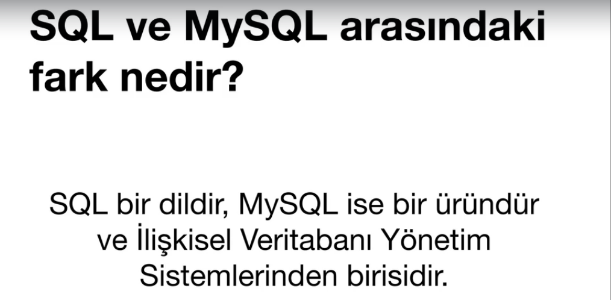
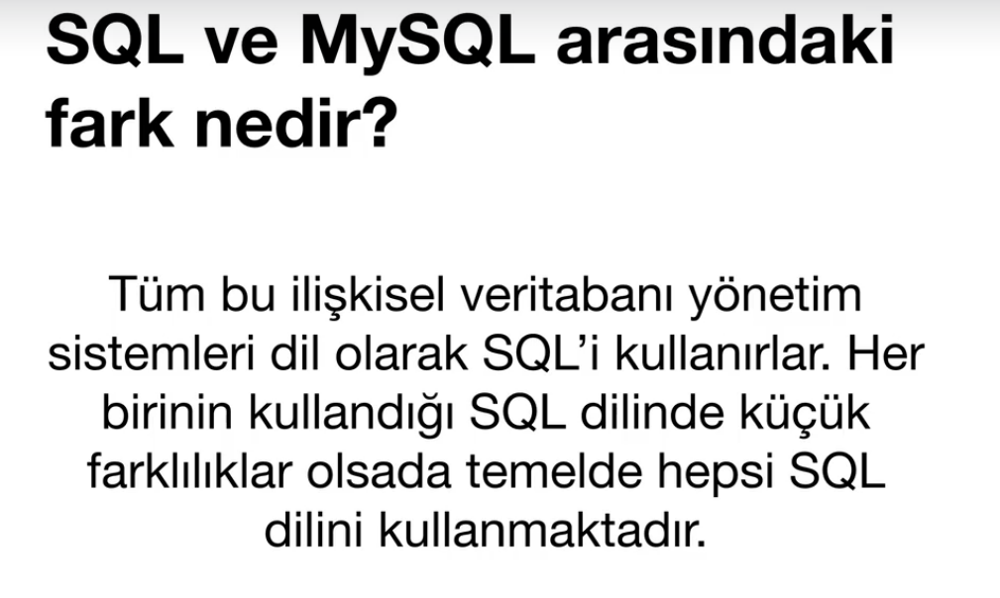

# MYSQL
## SQL ve MySQL Nedir? Farkları Nelerdir?


<b>Yani SQL bir dil , MYSQL ise bir üründür.Daha mantıklı açıklamak için alttaki fotoğrafı koyuyorum.</b>





<b>MYSQL ve SQL neden farklı? Şimdi anlatıyorum.Mesela Türkçe'de lehçeler vardır.Lazlar uşağum der,çerkezler nabıyon bea.</b>

<b>SQL tüm ürünlerin ana merkezidir.MYSQL bir SQL ürünüdür aynı şekilde MSQL de onun ürünüdür.SQL merkezdir.</b>




## Veritabanı (DATABASE) Oluşturmak / Silmek / Listelemek / Seçmek

```
2 şekilde veritabanı oluşturabiliriz .İkisini de söyleyeyim hemen alt satırlarda.

İlk olarak Mysql Workbench yada SqlPro gibi herhangi bir mysql programı indirmemiz lazım birçok alternatifi var bunun.

İlk olarak phpmyadminde SQL bölümüne girip # CREATE DATABASE test_veritabanı; diyoruz ve veritabanımız oluştu.

Bu arada herhangi farklı bir başlığın altında yazmayı da öğreteceğim.Sonra ama.

Silmek için de CREATE yazdığımız yere DROP yazıyoruz ve veritabanımız siliniyor.

İkinci yolumuz ise terminalden oluyor hemen alta kodları koyuyorum.

cd /Applications/MAMP yada LAMP/Library/Bin 

./mysql -u root -p 

Üstte yazdığımız kodları aynı şekilde yazarsak burda da işe yarıyor.

SHOW DATABASES; der isek tüm veritabanlarımız sıralanıyor.

USE herhangibir_veritabanı; der isek bundan sonra yaptığımız tüm işlemler bu veritabanı üstünde yapılacak.

```

Tablo (TABLE) Oluşturmak / Listelemek / Silmek

```

CREATE TABLE uyeler(
  test int
); Yazar isek tablomuz geliyor.test int'i yazmazsak hata alırız.

RENAME TABLE uyeler to users; Der isek tablomuzun adını değiştiririz.

DROP TABLE users; 
```

Sütun (COLUMN) Oluşturmak / Listelemek / Silmek

```
Sütun oluşturmak için tablo altında işlem yapmamız gerekiyor o yüzden alttaki kodlara iyi dikkat edin.

ALTER TABLE uyeler ADD COLUMN uye_id int

Bunun gibi başka bir örnek daha verelim.

ALTER TABLE uyeler ADD COLUMN (
    uye_adi varchar(255)
    uye_eposta varchar(255)
);
