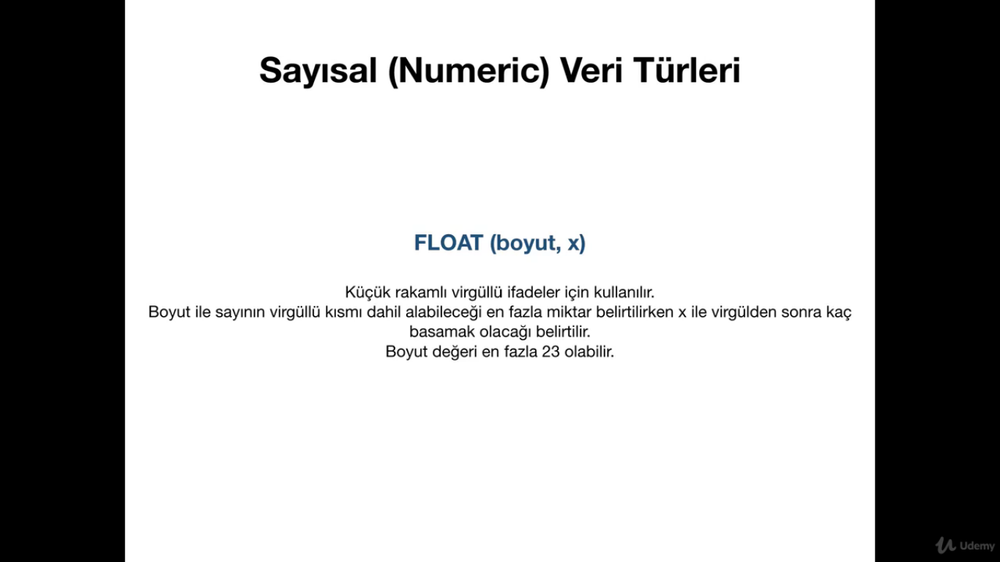

 # MYSQL
## SQL ve MySQL Nedir? Farkları Nelerdir?


<b>Yani SQL bir dil , MYSQL ise bir üründür.Daha mantıklı açıklamak için alttaki fotoğrafı koyuyorum.</b>


<b>MYSQL ve SQL neden farklı? Şimdi anlatıyorum.Mesela Türkçe'de lehçeler vardır.Lazlar uşağum der,çerkezler nabıyon bea.</b>

<b>SQL tüm ürünlerin ana merkezidir.MYSQL bir SQL ürünüdür aynı şekilde MSQL de onun ürünüdür.SQL merkezdir.</b>


## Veritabanı (DATABASE) Oluşturmak / Silmek / Listelemek / Seçmek

```
2 şekilde veritabanı oluşturabiliriz .İkisini de söyleyeyim hemen alt satırlarda.

İlk olarak Mysql Workbench yada SqlPro gibi herhangi bir mysql programı indirmemiz lazım birçok alternatifi var bunun.

İlk olarak phpmyadminde SQL bölümüne girip # CREATE DATABASE test_veritabanı; diyoruz ve veritabanımız oluştu.

Bu arada herhangi farklı bir başlığın altında yazmayı da öğreteceğim.Sonra ama.

Silmek için de CREATE yazdığımız yere DROP yazıyoruz ve veritabanımız siliniyor.

İkinci yolumuz ise terminalden oluyor hemen alta kodları koyuyorum.

cd /Applications/MAMP yada LAMP/Library/Bin 

./mysql -u root -p 

Üstte yazdığımız kodları aynı şekilde yazarsak burda da işe yarıyor.

SHOW DATABASES; der isek tüm veritabanlarımız sıralanıyor.

USE herhangibir_veritabanı; der isek bundan sonra yaptığımız tüm işlemler bu veritabanı üstünde yapılacak.

```

## Tablo (TABLE) Oluşturmak / Listelemek / Silmek

```

CREATE TABLE uyeler(
  test int
); Yazar isek tablomuz geliyor.test int'i yazmazsak hata alırız.

RENAME TABLE uyeler to users; Der isek tablomuzun adını değiştiririz.

DROP TABLE users; 
```

## Sütun (COLUMN) Oluşturmak / Listelemek / Silmek

```
Sütun oluşturmak için tablo altında işlem yapmamız gerekiyor o yüzden alttaki kodlara iyi dikkat edin.

ALTER TABLE uyeler ADD COLUMN uye_id int

Bunun gibi başka bir örnek daha verelim.

ALTER TABLE uyeler ADD COLUMN (
    uye_adi varchar(255)
    uye_eposta varchar(255)
);

ALTER TABLE uyeler ADD uye_sifre VARCHAR(255)
AFTER uye_adi  --> Der isek uye_adi 'ndan sonra uye_sifre'yi ekleyecektir. 

ALTER TABLE uyeler ADD uye_sifre VARCHAR(255)
FIRST der isek uye_sifre adlı sütunumuz uyeler adlı tablomuzda en başa gelecektir.

ALTER TABLE uyeler DROP COLUMN test2; Dediğimiz zaman uyeler tablosundaki test2 sütununu siliyor. 

Eğer bir sütunumuzun adını değiştirecek isek ; 

ALTER TABLE uyeler CHANGE uye_adi uye_kadi 
varchar(255) --> Bu arada varchar 255i yazmak isek hata alırız çünkü veri tipimizin ne olduğunu belirtmemiz lazım.
```

## PRIMARY KEY ve AUTO INCREMENT Kolonlar

```
Primary Key Nedir ? 
Bu arada vereceğim bilgileri alttaki kodları göz önünde bulundurarak ele almanızı istiyorum.

Türkçe'de birincil anahtar demektir.

Mesela ben ad kolonumu primary key olarak belirtir isem bunun anlamı ad kolonuma her satırda bir değer gelebilir demektir.
Ve bir defa kodda kullanılabilir adı üstünde birincil anahtar.
Hemen bir primary key oluşturalım.

CREATE TABLE uyeler (
  ad varchar(255),
  soyad varchar(255),
  PRIMARY KEY (ad)
);

Bir tane daha eklenme şeklini göstereyim.

CREATE TABLE uyeler (
  ad varchar(255),
  soyad varchar(255),
);

ALTER TABLE uyeler ADD PRIMARY KEY (ad);

Şimdi biz ad kolonumuza gelip içine 
Yiğithan Yılmaz yazdıktan sonra
Yiğithan Karaca yazamayız çünkü adı üstünde birincil anahtar hata alırız değerimizin hep aynı olması lazım.

Şimdi de AUTO INCREMENT'E geçelim.
AUTO INCREMENT Nedir?
Bir kolon auto increment olarak belirlendiğinde onun içindeki değerler otomatik olarak artışa geçer yani yen bir üye eklendiğinde atıyorum üyemizin id'si 1'den başlar 1 , 2, ,3 ,4 ,5 diye gidiyor.Hemen alta bir örnek yazalım.

CREATE TABLE uyeler (
  id int AUTO_INCREMENT,
  ad varchar(255),
  soyad varchar(255),
  PRIMARY KEY (id)
);

uye soyad kolonuna mesela ad soyad yazdık hemen önüne 1 2 diye kolonlarımız geliyor yani sıralanıyor.

1 Yiğithan Yılmaz
2 Test  Çikolata diye gider.
```

##  Tablo ve Sütunları Detaylı Listelemek

```
uyeler diye bir tablomuz vardı.İsterseniz önce tablonun altındaki sütunlara nasıl erişiyoruz.4 yolu var hemen alta koyuyorum.

EXPLAIN uyeler;

DESCRIBE uyeler;

SHOW FIELDS FROM uyeler;

SHOW COLUMNS FROM uyeler;

SHOW TABLES; --> tabloları gösterir.

Eğer başka bir veritabanındaki tabloları listelemek istersem ;

SHOW TABLES IN ecommerce;

3 tane değişmeyen tablomuz var 
information_schema
mysql
performation_schema

information_schema bize birçok bilgi sağlıyor ve birçok bilgi burada tutuluyor.Şimdiki dersimiz veri çekme değil ama burda basit bir şekilde yapalım.

SELECT * FROM information_schema.TABLES
WHERE TABLE_SCHEMA = 'udemy_test'

SELECT tümünü seç diyorum FROM nerden hangi tablonun tümünü seçicem  information_schema veritabanın altındaki TABLES tablosundan tümünü seç WHERE hangi koşul ile seçicem TABLE_SCHEMA 'i udemy_test e eşit olanları seçiyor.
 ```
 
 ## MYSQL VERİ TÜRLERİ
 

### Metinsel (String) Veri Türleri


VARCHAR ise sakladığımız alan kadar veri kaplar.Mesela varchar 4000 dedik ama 200 satırlık yer kapladı mantığı anlamışsınızdır.


### Sayısal (Numeric) Veri Türleri





## MySQL Rezerve Edilmiş Kelimelerin Kullanımı

## Veri Ekleme (INSERT) İşlemi

INSERT INTO uyeler SET 
uye_kadi = 'tayfunerbilen',
uye_sifre = '123,
uye_eposta = 'tayfunerbilen@gmail.com' dedik ve uyeler tablomuza bunları ekledik. 

## Veri Çekme (SELECT) İşlemi

SELECT * FROM uyeler 
Üstteki yıldız tamamını çek demek yanı uyelerdeki bütün kolonlar ve bütün satırlarımla birlikte çekiliyor demek.

SELECT uye_kadi, uye_sifre FROM uyeler 
Bu da uye_kadi ve uye_sifreyi sadece çek demek 

SELECT uye_kadi as kadi, uye_sifre as sifre FROM uyeler 
Kolonun adı değişti ve aynı şekilde veriyi çektik

## VERİ GÜNCELLEME (UPDATE) İşlemi 
idsi 8 olan test2 adındaki kullanıcımın mesela  yigithanla değiştirmek istiyorum mesela  

UPDATE uyeler SET
uye_kadi = 'yigithan'
WHERE uye_id = 8 

Eğer WHERE uye_id = 8 diye yazdığım kodu yazmasaydım tüm kullanıcı adları yigithan olacaktı biz burda id'yi belirttik.

## VERİ SİLME (DELETE) İşlemi 

DELETE FROM uyeler 
WHERE uye_id = 8

## WHERE Cümleciği 
SELECT * FROM uyeler
WHERE uye_id = 7
idsi 7 olan veritabanını çekecek.

SELECT * FROM uyeler 
WHERE uye_sifre = 'yenişifre'
Burda da uye şifresi yeni şifre olan kullanıcıyı çekecek.

## Verilerde Sıralama (ORDER BY)
Verilerimizi büyükten küçüğe yada başka bir filtreye göre sıralamak istiyor isek ORDER BY  kodumuzu kullanıyoruz.

SELECT * FROM bolumler 
Böyle der isek id'si diğer şeyleri karışık bir şekilde gelecek.Ama alttaki şekide kullanırsak bir filtreye göre gelecek.

SELECT * FROM bolumler
ORDER BY id DESC (büyükten küçüğe) (ASC küçükten büyüğe)

SELECT * FROM bolumler
ORDER BY bolum_sezon, bolum_no DESC

## Verilerde Limit (LIMIT)

SELECT * FROM uyeler
ORDER BY uye_id (DESC büyüktenküçüğe) (ASC küç. büy.)

## Verilerde Gruplama (GROUP BY) ve HAVING Kullanımı
SELECT * FROM calisanlar
GROUP BY sehir

## Verilerde Arama (LIKE)
SELECT * FROM calisanlar
WHERE ad LIKE '%n'  sonu n ile biten ad kolonundaki şeyleri sıralayacak eüer y%n olsaydı y ile başlayıp n ile bitenler olacaktı.

## Verilerde Arama (IN)
SELECT * FROM calisanlar
WHERE id = 5 || id = 6 || id = 7
Bu kodun kısa hali IN ile kullanılmışını hemen alta koyuyorum.

SELECT * FROM calisanlar
WHERE id  IN (5,6,7)

## Verilerde Arama (FIND_IN_SET)
